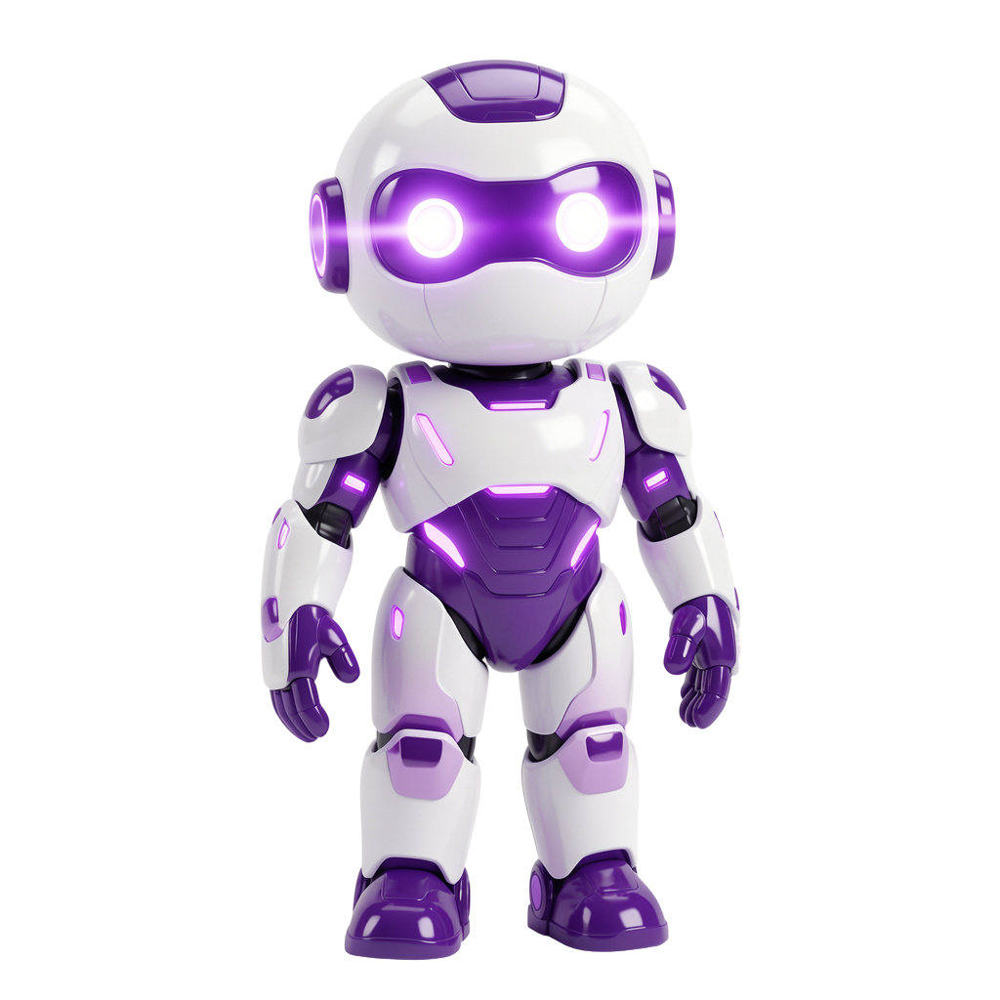
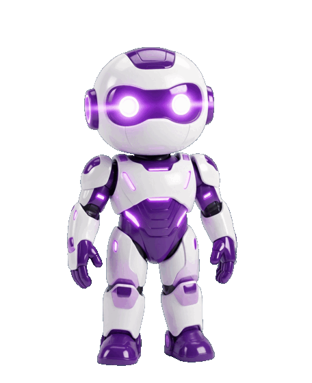
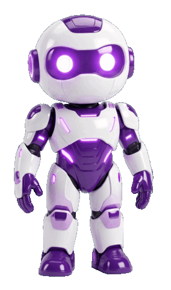
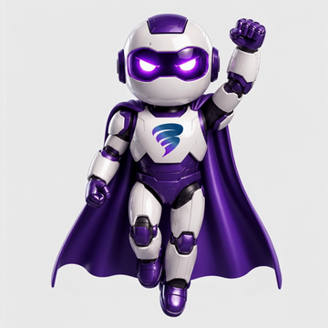

# Character Animation Skill — turn any image into a looping animated sprite with Nano Banana 2

Turn a single **static character image** into a smooth, looping **animated sprite** —
delivered as a self-contained **moving SVG**, an **animated WebP**, and an **animated
GIF** with a transparent background. It's a [Claude Code](https://docs.claude.com/en/docs/claude-code)
**skill** that drives Google's **Nano Banana 2** (`gemini-3.1-flash-image`, Gemini 3.1
Flash Image) to generate the animation frames, then keys, aligns, times, and assembles
them into ready-to-use animation files.

> Give it a picture of a robot and the words "wave hello and blink" — get back a looping
> animated robot in three web-ready formats.

[](LICENSE)


---

## Demo: from one static image to fluid animation

A single product render of a robot, animated two ways by the skill — a friendly **hand
wave with a blink**, and a calm **idle** (breathing + slow blink + gentle sway). Both are
transparent, looping, and generated from the one image on the left.

| Input image | Wave + blink | Idle (breathe · blink · sway) |
|:---:|:---:|:---:|
|  |  |  |
| static asset | per-frame generation, eased timing | keyframes + motion interpolation |

*(See the [full case study](#case-study-the-robot) below for exactly how each was made.)*

---

## What it does

- **Image → animation.** Input one character/asset image + a motion description; output a
  looping animated **SVG + WebP + GIF**, background removed to transparency.
- **Powered by Nano Banana 2** (`gemini-3.1-flash-image`) — Google Gemini's fast image
  model — for 512px / 1K / 2K / **4K** frame generation.
- **Two generation modes** depending on the subject:
  - **Single-sheet** (one API call) for **organic/amorphous** subjects (creatures, flame,
    smoke) where natural frame drift reads as life.
  - **Per-frame** (one call per frame, edited from a fixed "base plate") for **rigid /
    articulated** characters (robots, humans, mascots) that need a consistent body.
- **Video → animation (Path C).** Already have the motion in a clip? Pull a time range
  (e.g. the first 2 s), drop the background, and get the same looping SVG + WebP + GIF —
  no generation, no API key. See the [video use case](examples/superhero-mascot/).
- **Background keying** — white-background connected-components keyer, a chroma-key path
  (green screen) with green-spill suppression, **and** a shape-based **ML keyer** (U²-Net)
  for subjects color can't separate (a white robot on a white background, photos, video).
- **Natural, fluid motion** — variable per-frame timing (ease-in/ease-out), and optional
  **motion interpolation** (ffmpeg `minterpolate`) to synthesize smooth in-betweens.
- **Self-contained output** — the moving SVG embeds the frames; one file, loops in any
  modern browser.

## How it works

```
character image + motion description
        │   Nano Banana 2  (gemini-3.1-flash-image)
        ▼
   animation frames (sprite sheet, or per-frame on a chroma background)
        │   key background · normalize scale/position · (interpolate) · time
        ▼
   moving SVG  +  animated WebP  +  animated GIF   (transparent, looping)
```

Or skip generation entirely and start from a **video** (Path C):

```
video clip ──▶ extract frames ──▶ ML background removal (U²-Net) ──▶ montage
        ──▶ moving SVG  +  animated WebP  +  animated GIF   (transparent, looping)
```

## Installation

**Requirements:** [Claude Code](https://docs.claude.com/en/docs/claude-code),
Python 3, **ImageMagick 7** (`magick`), **ffmpeg** (for interpolation and video
input), and a **Google Gemini API key** (only for generation — Path C / video needs
no key). The ML keyer (Path C) additionally uses `onnxruntime`, `numpy` and `Pillow`.

```bash
# 1. Clone and install the skill for Claude Code
git clone https://github.com/karem505/character-animation-skill.git
mkdir -p ~/.claude/skills
cp -r character-animation-skill ~/.claude/skills/character-animation

# 2. Provide your Gemini API key (either way works)
export GEMINI_API_KEY="your-key-here"
#   …or persist it:
mkdir -p ~/.config/character-animation
printf 'GEMINI_API_KEY=your-key-here\n' > ~/.config/character-animation/key.env
chmod 600 ~/.config/character-animation/key.env
```

Get a key from [Google AI Studio](https://aistudio.google.com/apikey). The key is read
from the environment or the local config file at runtime and is **never** stored in the
skill or this repository.

## Usage

In Claude Code, just ask in plain language:

> "Animate this robot waving hello and blinking" · "make this mascot move" ·
> "turn this logo into a moving SVG" · "give me an idle animation for this character"

The skill picks the right mode and runs the pipeline. You can also run the scripts
directly:

```bash
# Mode 1 — single-sheet (organic subjects), one call, up to 4K
python3 scripts/generate_spritesheet.py character.png sheet.png \
  --motion "the creature gently floats and waves its tentacles" --rows 6 --cols 6 --size 4K
python3 scripts/spritesheet_to_animation.py sheet.png --rows 6 --cols 6 \
  --out-dir out --name creature

# Mode 2 — per-frame (rigid characters): base plate → posed frames → assemble
python3 scripts/generate_posed_frames.py base_plate.png poses.json --out-dir frames --size 2K
python3 scripts/frames_to_sheet.py frames --cols 6 --rows 4 --bg-color "#00B140" --out sheet.png
python3 scripts/spritesheet_to_animation.py sheet.png --keep-bg --cols 6 --rows 4 \
  --durations "1.4,1.7,1,..." --out-dir out --name robot

# Fluidity — interpolate a few keyframes into many in-between frames
python3 scripts/interpolate_frames.py norm_frames interp_frames --factor 4 --chroma "#00B140"

# Path C — start from a video: first 2s → ML background removal → looping asset
python3 scripts/video_to_frames.py clip.mp4 frames_raw/ --start 0 --duration 2 --size 800
python3 scripts/remove_bg_ml.py frames_raw/ frames_cut/
magick montage frames_cut/f_*.png -tile 8x6 -geometry 800x800+0+0 -background none sheet.png
python3 scripts/spritesheet_to_animation.py sheet.png --keep-bg --cols 8 --rows 6 \
  --fps 24 --out-dir out --name mascot
```

See **[SKILL.md](SKILL.md)** for the full workflow, mode selection, and every option.

## Case study: the robot

The robot above (a white-and-purple humanoid on a transparent background) shows the whole
toolkit, and the lessons learned getting it smooth:

1. **White subject → chroma key.** A white robot on a white background can't be separated,
   so the frames are generated on a **green screen** and keyed out (with green-spill
   suppression), preserving the robot's own white panels.
2. **Rigid body → per-frame generation.** A single-sheet wave came out choppy with jumping
   size and disappearing legs. Generating each frame as an edit of one **fixed base plate**
   keeps the robot consistent, full-body, and planted. → `robot-wave.gif`
3. **Fluid motion → fewer keyframes + interpolation.** For the **idle**, the motion was
   split across two pose sets (breathing + slow blink, and a gentle weight sway), generated
   as ~12 keyframes, then **motion-interpolated** into ~40 smooth frames. → `robot-idle.gif`
4. **Natural timing.** Per-frame hold weights add ease-in/ease-out — holding the
   anticipation, the apex, and the closed-eye beat — so nothing feels mechanical.

**By the numbers:** the wave was generated as **24 frames at 2K** in ~90 seconds; the idle
was built from **12 keyframes interpolated into ~40 fluid frames**. Nano Banana 2 renders a
**4096×4096** sheet at the `4K` setting. All output is transparent and loops seamlessly.

The animation principles behind this (timing & spacing, overlapping action, blink recipe)
are summarized with sources in
[`references/animation-fluidity.md`](references/animation-fluidity.md).

## Use case: a video clip → looping web asset (Path C)

Sometimes you already have the motion — a rendered animation or a generated `*.mp4` —
and just want it as a transparent, looping website asset. Path C does exactly that, with
**no generation** and **no API key**.

| Input video | Output (background removed) |
|:---:|:---:|
|  |  |
| 1440×1440, 24 fps, light-grey set | first **2 s** → 48 frames @ 24 fps, true alpha |

The mascot's body is white and the background is near-white, so no color key can separate
them. The **ML keyer** (`remove_bg_ml.py`, U²-Net via onnxruntime) segments by *shape*
instead, and keeping the source 24 fps preserves the original flight motion. Full
walkthrough and reproduce-it commands: **[`examples/superhero-mascot/`](examples/superhero-mascot/)**.

## Nano Banana 2 notes

- **Model id:** `gemini-3.1-flash-image` (a.k.a. **Nano Banana 2**, Gemini 3.1 Flash Image).
- Resolution is set via `generationConfig.imageConfig.imageSize` = `512`/`1K`/`2K`/`4K`
  (uppercase `K`), with `aspectRatio`. 4K returns a 4096×4096 image.
- Output is JPEG with **no transparency** — hence the background-keying step.
- It can restyle detailed characters; per-frame editing of the real image preserves identity
  far better than re-drawing from scratch.

Full, verified API details: [`references/nano-banana-2.md`](references/nano-banana-2.md).

## Repository structure

```
character-animation-skill/
├── SKILL.md                         # the Claude Code skill (workflow + options)
├── scripts/
│   ├── generate_spritesheet.py      # Mode 1: one call → a full sprite sheet
│   ├── generate_posed_frames.py     # Mode 2: per-frame editing from a base plate
│   ├── frames_to_sheet.py           # normalize + lock scale/position into a grid
│   ├── interpolate_frames.py        # motion interpolation for fluid in-betweens
│   ├── video_to_frames.py           # Path C: extract a time range from a video
│   ├── remove_bg_ml.py              # ML keyer: U²-Net shape-based bg removal
│   └── spritesheet_to_animation.py  # any sheet → SVG + WebP + GIF (eased timing)
├── references/
│   ├── nano-banana-2.md             # Nano Banana 2 / Gemini image API reference
│   └── animation-fluidity.md        # cited research: natural, fluid animation
└── examples/
    ├── robot/                       # case-study assets (original + wave + idle)
    ├── superhero-mascot/            # Path C: video → looping web asset (source + GIF)
    └── octopus-animated.svg         # Mode 1 example (organic subject)
```

## FAQ

**What is Nano Banana 2?** Nano Banana 2 is Google Gemini's image generation and editing
model, with the API model id **`gemini-3.1-flash-image`** (Gemini 3.1 Flash Image). It
generates and edits images at 512px, 1K, 2K, and 4K, and is the model this skill uses to
create animation frames from your input image.

**How do I turn an image into an animation?** Give the skill one character image and a short
motion description (e.g. "wave and blink"). It generates the frames with Nano Banana 2,
removes the background, aligns and times them, and outputs a looping animated **SVG, WebP,
and GIF** with transparency.

**What output formats does it produce?** Three: a self-contained **moving SVG** (frames
embedded, loops in any browser), an **animated WebP** with true alpha, and an **animated
GIF**. The cleaned transparent sprite sheet is saved too.

**Can I turn a video into an animated asset?** Yes — that's **Path C**. Extract a time
range with `video_to_frames.py`, remove the background with the shape-based ML keyer
`remove_bg_ml.py` (no `rembg` needed — just `onnxruntime`), montage, and convert with
`--keep-bg`. No Gemini key required. Worked example: [`examples/superhero-mascot/`](examples/superhero-mascot/).

**My subject is white/pale on a light background and the keyer eats it — what now?** Use
the ML keyer (`remove_bg_ml.py`), which separates by shape rather than color. It also
handles photos and video frames where you can't re-shoot on a green screen.

**Does this work without Claude Code?** Yes. The Python scripts run standalone — generation
needs a Gemini API key, and everything needs ImageMagick 7; ffmpeg + onnxruntime cover
interpolation and the video/ML path. The skill packaging is what lets Claude Code drive
them from natural-language requests.

**Why Nano Banana 2 instead of Nano Banana Pro?** Nano Banana 2 (`gemini-3.1-flash-image`) is
fast and inexpensive with near-Pro quality. Nano Banana Pro (`gemini-3-pro-image`) preserves
character identity better but costs more — pass `--model gemini-3-pro-image` to switch.

**How do I fix a choppy animation?** Use fewer, cleaner keyframes and **interpolate** them
into smooth in-betweens with `interpolate_frames.py`, and prefer subtle/idle motion for rigid
characters. Big motions need more real keyframes. Details in [SKILL.md](SKILL.md).

**Is my API key safe?** Yes — it's read from an environment variable or a local config file
at runtime and is never written into the skill or committed to this repository (see
`.gitignore`).

## License

[MIT](LICENSE) © 2026 Karem. Built with [Claude Code](https://claude.com/claude-code).
Animation generation uses Google's Gemini API (Nano Banana 2). The example robot and octopus
renders are included for demonstration.
