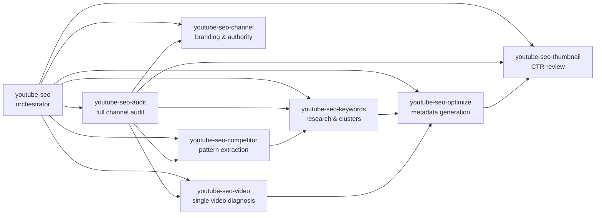

# YouTube SEO Skills (Advanced)

Skill suite for [Claude Code](https://claude.com/claude-code) that covers
YouTube SEO analysis, optimization, and strategy. Models YouTube's modern
recommender system (session watch time / Reinforce / persona matching),
not just keyword match.

[](https://opensource.org/licenses/MIT)
[](https://claude.com/claude-code)

## Quick Install

**One-liner (global — recommended):**

```bash
curl -fsSL https://raw.githubusercontent.com/deeployCO/youtube-seo-skills/main/install.sh | bash
```

**Project-local (only this project):**

```bash
curl -fsSL https://raw.githubusercontent.com/deeployCO/youtube-seo-skills/main/install.sh | bash -s -- --local
```

**Pin to a specific release:**

```bash
curl -fsSL https://raw.githubusercontent.com/deeployCO/youtube-seo-skills/main/install.sh | bash -s -- --ref v0.1.0
```

Then in any Claude Code session:

```
/youtube-seo-audit       https://youtube.com/@yourhandle
/youtube-seo-video       https://youtube.com/watch?v=VIDEO_ID
/youtube-seo-optimize    https://youtube.com/watch?v=VIDEO_ID
/youtube-seo-keywords    "your niche"
/youtube-seo-thumbnail   thumbnail.jpg
/youtube-seo-competitor  https://youtube.com/@competitor
```

## Workflow



**New video launch** → `keywords` → `optimize` → `thumbnail`
**Underperforming video** → `video` (with Studio CSV) → `optimize`
**Channel overhaul** → `audit` (orchestrates the rest)
**Strategic planning** → `competitor` → `keywords` → content calendar

## Skills

| Skill | Purpose |
|-------|---------|
| `youtube-seo` | Orchestrator — routes intent, holds the advanced ranking-factor model and niche benchmarks |
| `youtube-seo-audit` | Full channel audit with parallel delegation, topical authority scoring, traffic-source analysis |
| `youtube-seo-video` | Single-video deep dive with retention-curve diagnosis, entity coverage, Key Moments schema, audio loudness |
| `youtube-seo-optimize` | Paste-ready Browse + Search title variants, entity-rich descriptions, translated metadata, 15s hook script, VideoObject schema |
| `youtube-seo-channel` | Identity, topical authority, session-chain playlists, trailer script, translations, community strategy |
| `youtube-seo-keywords` | Intent classification, entity mapping, refined opportunity formula, seasonality, topic clusters for authority |
| `youtube-seo-thumbnail` | CV-based analysis (face/emotion), CLIP similarity vs SERP, Gestalt composition, native Test & Compare plan |
| `youtube-seo-competitor` | Pattern extraction from transcripts, hook analysis, format-market-fit, entity gap matrix, moats |

## Helper Scripts (`scripts/`)

| Script | What it does |
|--------|-------------|
| `fetch_video.py` | Full video metadata via YouTube Data API → yt-dlp fallback; optional transcript + thumbnail download |
| `fetch_channel.py` | Channel details, recent uploads, top-by-views, batched video stats |
| `analyze_thumbnail.py` | OpenCV face detection, dominant colors (k-means), contrast, MSER text regions, mobile previews, CLIP similarity vs SERP grid |
| `audio_loudness.py` | yt-dlp audio extract + FFmpeg loudnorm (LUFS, true peak, LRA) for retention diagnosis |
| `requirements.txt` | Python deps (yt-dlp, opencv, CLIP, etc.) |

External binary dependencies: `ffmpeg`, `yt-dlp`.

## Manual Install (alternative to the one-liner)

```bash
# Clone the repo
git clone https://github.com/deeployCO/youtube-seo-skills.git
cd youtube-seo-skills

# Copy skills into your global skill folder
cp -r youtube-seo* ~/.claude/skills/
cp -r scripts ~/.claude/skills/youtube-seo/

# (Optional) Helper script dependencies for advanced analysis
pip install -r scripts/requirements.txt
brew install ffmpeg yt-dlp     # macOS

# (Optional) API key for full tag/stats/topicDetails coverage
export YOUTUBE_API_KEY="your-key-here"
```

Each skill is a directory with a `SKILL.md` (YAML frontmatter + body),
user-invokable via `/youtube-seo`, `/youtube-seo-audit`, etc.

## Data Source Priority

**First-party only.** These skills deliberately avoid third-party
analytics tools (VidIQ, TubeBuddy, Ahrefs, SocialBlade, NoxInfluencer,
HypeAuditor, etc.) — they rate-limit, change their HTML, and generate
errors that block runs. Every source below is an official
Google/YouTube endpoint, a local CLI, or data the user provides
directly.

Skills try in this order and degrade gracefully:

1. **YouTube Data API v3** (`YOUTUBE_API_KEY`) — full snippet, tags,
   statistics, topicDetails, contentDetails, captions metadata
2. **YouTube Studio CSV exports** (user-provided) — the only source
   for Tier 1 signals (real CTR, APV, retention curves, traffic
   sources)
3. **`yt-dlp`** — metadata, chapters, captions, transcript, audio
   extract, and `ytsearch:` SERP (API-less equivalent)
4. **YouTube suggest API** — keyword expansion, no key required
5. **`WebFetch`** — public watch / channel / search-results pages
   (last resort)
6. **Google Trends** (WebFetch) — seasonality and relative interest
7. **Whisper** — transcript fallback when captions unavailable
8. **FFmpeg** — audio loudness (LUFS, true peak, LRA)
9. **OpenCV + CLIP** — thumbnail computer vision and SERP similarity
10. **`seo-dataforseo` MCP** *(OPTIONAL)* — extra SERP / volume data,
    used only if already installed and not erroring; any failure is
    silently skipped

If critical data for a Tier 1 signal (retention, real CTR) is
missing, skills will ASK for it rather than guess. If an optional
tool errors, skills continue with native sources instead of blocking.

## Advanced Ranking Model

The shared ranking model lives in `youtube-seo/SKILL.md` and spans six
tiers:

1. **Watch-time & session signals** (dominant): APV, AVD, 0:30 retention,
   retention cliffs, session contribution, returning viewers, surface-
   specific CTR (Browse ≠ Search ≠ Suggested)
2. **Metadata & semantic signals**: entity coverage from Knowledge Graph,
   Key Moments chapters, translated metadata, above-fold description
3. **Thumbnail pre-click signals**: 120px legibility, SERP differentiation
   via CLIP, face+emotion, Gestalt composition
4. **Engagement & velocity signals**: first-24h velocity, pinned-comment
   replies, end-screen CTR, subscribe-per-1000-views
5. **Channel-level signals**: topical authority concentration, upload
   cadence stddev, session chains, persona classification
6. **Technical & safety signals**: audio loudness (-14 LUFS target),
   MFK flag, AI disclosure, copyright claims, embedding

Plus surface-specific rules for Shorts (first 0.5-1.0s hook, loopability,
caption overlay, trending audio).

## Suggested Workflows

- **New video launch**: `youtube-seo-keywords` → `youtube-seo-optimize`
  → `youtube-seo-thumbnail`
- **Underperforming video (diagnosis)**: `youtube-seo-video` (with
  Studio CSV) → `youtube-seo-optimize` (fixes)
- **Channel overhaul**: `youtube-seo-audit` (orchestrates the rest)
- **Strategic planning**: `youtube-seo-competitor` → `youtube-seo-keywords`
  → content calendar
- **Shorts strategy**: `youtube-seo-optimize` with Shorts template +
  `youtube-seo-competitor` for hook patterns
- **International expansion**: `youtube-seo-channel` (translations block)
  + `youtube-seo-optimize` (translated metadata output)

## What's NOT in these skills

- **Video editing or production** — retention is driven by editing; the
  skills diagnose but don't edit
- **YouTube Studio automation** — all rewrites are paste-ready for manual
  application
- **Ads / monetization strategy** — see `ads-youtube` skill for paid
  YouTube
